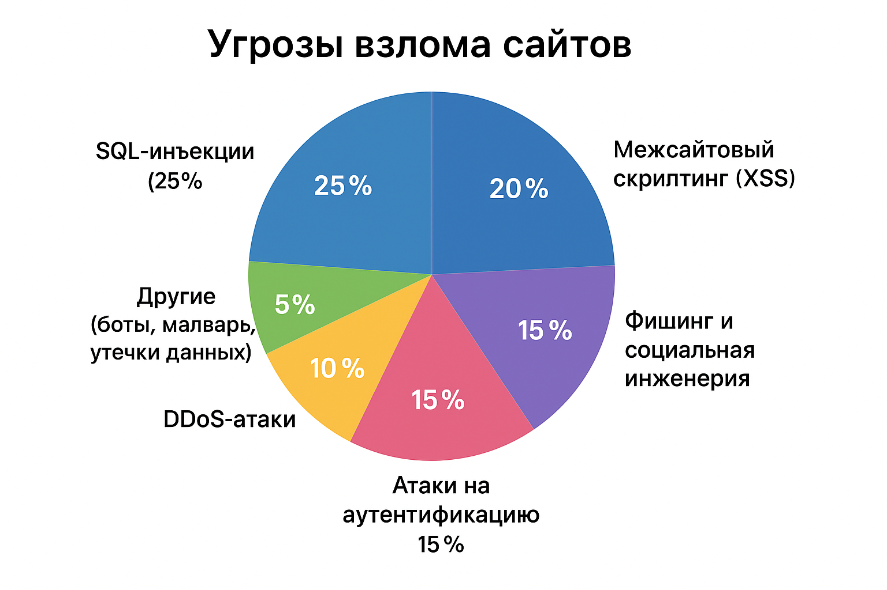

# Киберполигон

## О проекте

Киберполигон моделирует реальные киберугрозы, чтобы обучить участников выявлению уязвимостей, предотвращению атак и защите сетей. Наша цель — способствовать сотрудничеству студентов, экспертов и организаций для создания устойчивых цифровых систем.

### Цели
- Развитие практических навыков кибербезопасности.
- Симуляция сложных кибератак (APT).
- Повышение осведомленности о кибергигиене.

